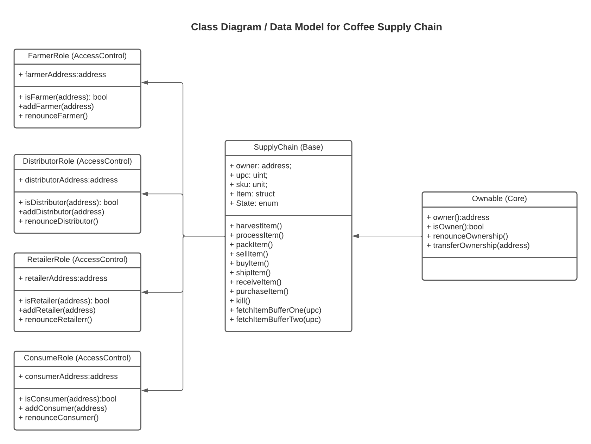

# Blockchain - Coffee Supply Chain (Udacity Blockchain Developer - project 3)
This repository containts an Ethereum DApp that demonstrates a Supply Chain flow between a Seller and Buyer. The user story is similar to any commonly used supply chain process. A Seller can add items to the inventory system stored in the blockchain. A Buyer can purchase such items from the inventory system. Additionally a Seller can mark an item as Shipped, and similarly a Buyer can mark an item as Received.

## Project write-up

### Activity Diagram

### Sequence Diagram

### State Diagram

### Class - Data Model Diagram

## Project write-up
## Additional Libraries Used
None
## IPFS Details
IPFS Not used
## Program Versions numbers
Node: v17.4.0
Solidity: v0.4.24
Truffle: v5.4.33
Web3.js: v1.5.3
truffle-hdwallet-provider: v8.3.1
## Deployed Contract addresses - Rinkeby Test Network
https://rinkeby.etherscan.io/address/0x8275fc5c250b471163ffc7344b0fb61bf51e96f5

